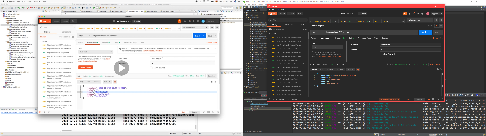
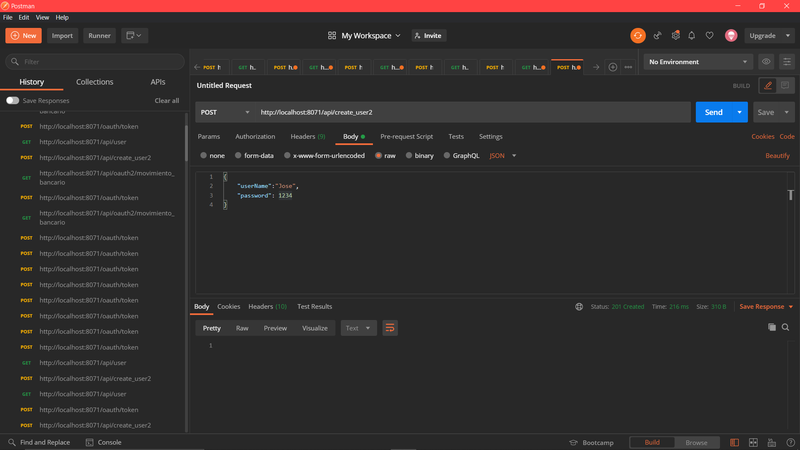
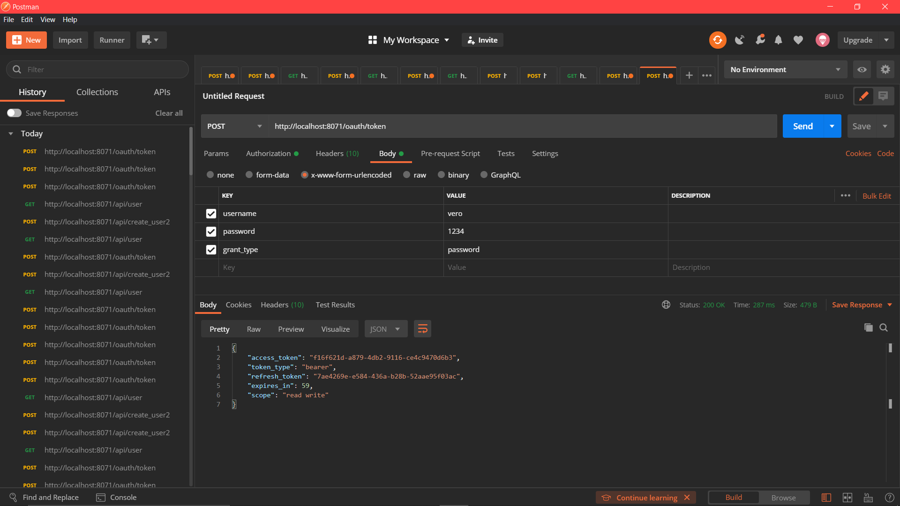
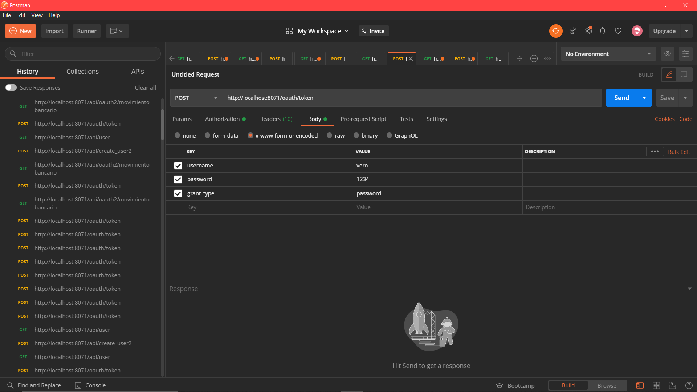
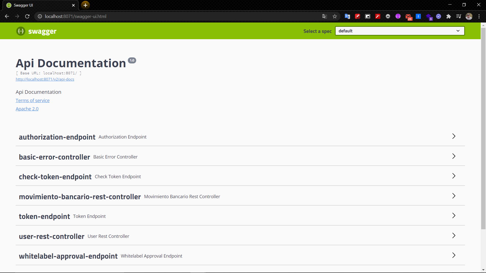
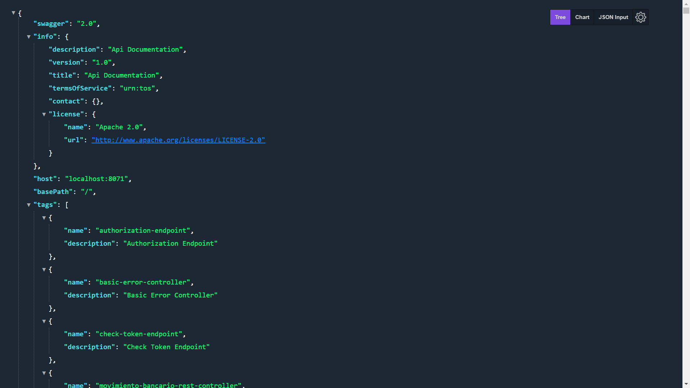

# Práctica-OAuth2
Práctica con Spring boot y OAuth2 (estándar abierto y simple para la autenticación segura de API´s) 

#### Este proyecto cuenta con las siguientes dependencias: 

  + ***Spring Data JPA*** -> Persistencia de datos
  + ***Spring Web*** -> Permite crear aplicaciones web. Utiliza el servidor Apache Tomcat como servidor predeterminado
  + ***H2*** -> Base de datos en memoria
  + ***MySQL*** -> Controlador de conexión
  + ***OAuth2*** -> Permite autorizar con quien compartir información entre api´s
  + ***Spring Boot DevTools*** -> Reinicio rápido de la aplicación
  + ***Springfox Swagger2*** -> Api que permite documentar en formato JSON 
  + ***Springfox Swagger UI*** -> Api que permite mostar la socumentación del proyecto en una interfaz gráfica 

#### El fichero de propiedades configurado en [.yaml]( src/main/resources/application.yaml)

  

  
   

  
   

  
   

